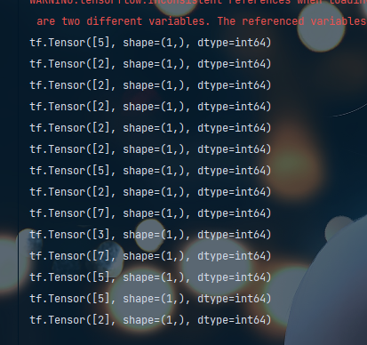

深度学习是机器学习中的一个分支，在深度学习图像识别领域中，同样存在着攻与防，图像对抗样本攻击算法中有：FGSM、I-FGSM、PGD、BIM。这些算法能够干扰某些模型的识别准确率，比如模型识别到一张为5的手写数字，但是经过FGSM算法攻击之后，模型会将该图片识别为9。因此鲁棒性对于模型来说非常重要。 安全团队近日截获了一个压缩包，该文件企图泄漏某关键数据。经专家分析发现，该文件中包含一个利用TensorFlow训练好的模型文件，而且训练该模型的数据集是著名的手写数据集MNIST，在另外一个文件夹中有一堆图片，经过反推分析，这些图片中在模型识别后能够输出一个数字，将这些数字组合之后，即可得到关键信息，经过分析可知该网络结构中隐藏层512个神经元，输出层为10。你能还原这些信息吗？flag形式为：flag{0-12的图识别出来的数字组合}

通过tf2实现：

- 数据集的读取
- 模型的复现
- 模型加载
- 模型预测

